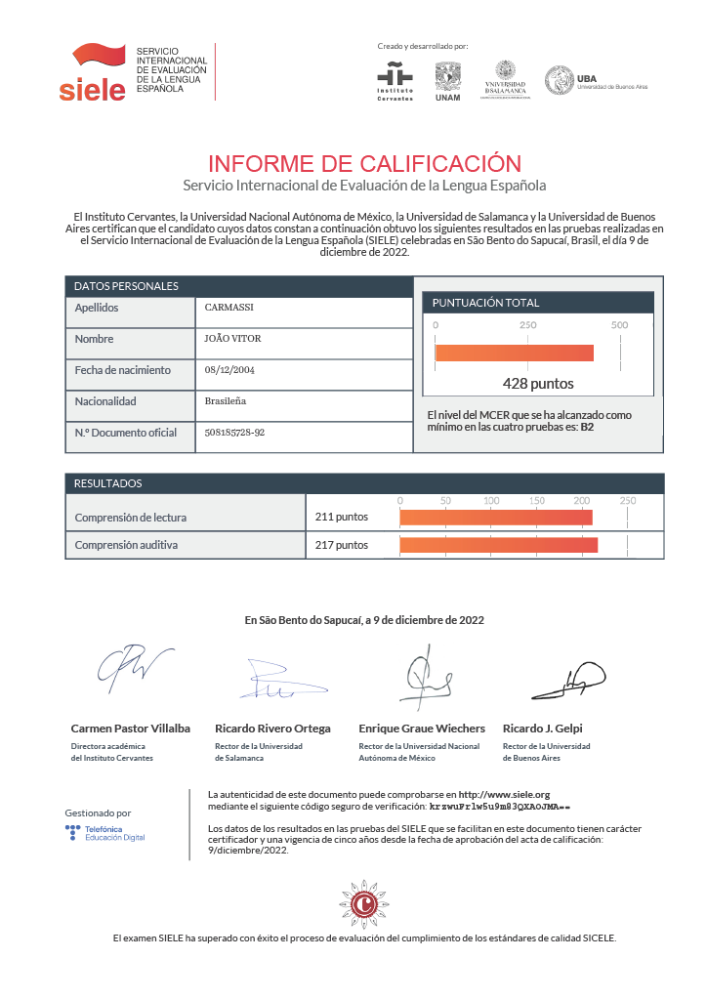

  

  <h1 align="center">About Me 👤</h1>
  <h3>
    Hello! My name is João Vitor Carmassi, and I’m a Front-End Developer specialized in building interactive, responsive, and user-centered interfaces using technologies such as React and Tailwind CSS. I have designed, developed, and optimized digital experiences that combine performance, usability, and modern design standards.
  </h3>
  <h3>
    I’m driven by complex challenges and the opportunity to engineer innovative solutions. I continuously research, analyze, and implement emerging technologies to stay aligned with industry evolution. Solving real-world problems through code allows me to deliver measurable impact and create scalable, high-quality products.
  </h3>
  <h3>
    Beyond technical execution, I value collaboration and have collaborated, communicated, and contributed effectively within teams to achieve shared goals. I also actively pursue continuous improvement, consistently strengthening both technical and strategic skills.
  </h3>
  <h3>
    Outside of work, I engage in gaming, music, movies, and outdoor activities such as hiking and exploring new places. These experiences enhance creativity, balance, and perspective, supporting both personal development and professional performance.
  </h3>

 

  <h1>Personal Stats ⚡</h1>
  
  
  
  
  
  
  
  
  
  
  
  
  
  
  
  
  
  
  

  
 
  

  
  
  

 

  <h1 align="center">Languages 📓</h1>
  <table>
    <thead>
      <tr>
        <th>
          English C1
        </th>
        <th>
          Spanish B2
        </th>
      </tr>
    </thead>
    <tbody>
      <tr>
        <td>
          
        </td>
        <td>
          
        </td>
      </tr>
    </tbody>
  </table>

 

  <h1>Contacts 📱</h1>
  
  
  
  

