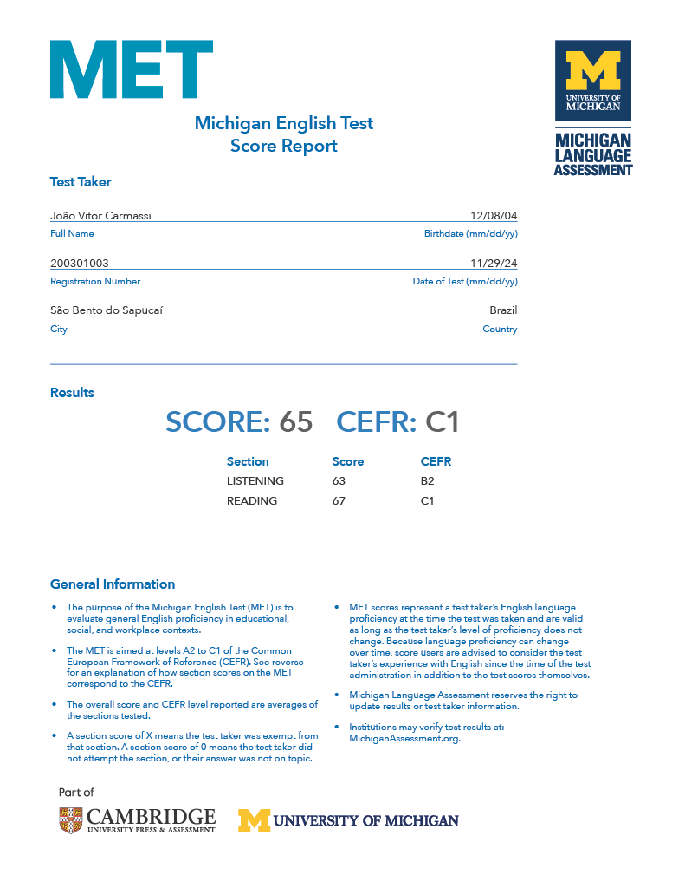

  

  <h1 align="center">About Me 👤</h1>
  <h3>
    Hello! My name is João Vitor Carmassi, and I’m a web developer specialized in front-end. I have a strong passion for building interactive, responsive, and user-centered interfaces using technologies like React and Tailwind CSS.
  </h3>
  <h3>
    I’m always motivated by the constant challenges that programming brings and the chance to create innovative solutions. The tech industry’s evolution keeps me on my toes, and every new learning experience feels like a step forward. Solving real-world problems through code is one of the most rewarding aspects of my work.
  </h3>
  <h3>
    When I’m not coding, I engage in activities such as gaming, listening to music, watching movies and series, and spending time with friends. I also enjoy exploring new locations, hiking, and participating in outdoor activities, as I believe in the importance of a well-rounded lifestyle for personal growth and maintaining a healthy work-life balance.
  </h3>

 

  <h1>Personal Stats ⚡</h1>
  
  
  
  
  
  
  
  
  
  
  
  
  

  
 
  

  
  
  

 

  <h1 align="center">Languages 📓</h1>
  <table>
    <thead>
      <tr>
        <th>
          <h3>English C1</h3>
        </th>
        <th>
          <h3>Spanish B2</h3>
        </th>
      </tr>
    </thead>
    <tbody>
      <tr>
        <td>
          
        </td>
        <td>
          
        </td>
      </tr>
    </tbody>
  </table>

 

  <h1>Contacts 📱</h1>
  
  
  
  

